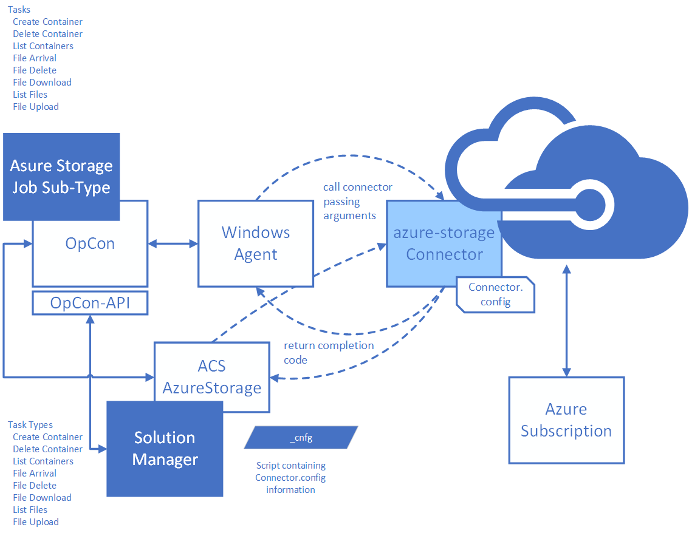

# Azure Storage Connector overview

**Theme:** Overview | **Audience:** Automation Engineers, System Administrators

## What is it?

The Azure Storage Connector is an OpCon connector for Windows that uses the Azure Java SDK to interact with Microsoft Azure Blob Storage. It enables OpCon to automate file and container management tasks as part of a scheduled workflow.

- Use this connector when you need to automate the movement, management, or monitoring of files stored in Azure Blob Storage as part of an OpCon schedule
- Use this connector when your organization transfers files between on-premises systems and Azure Storage as part of batch processing
- Use this connector to trigger downstream jobs when a specific file arrives in a container, enabling event-driven automation
- Reduces manual effort for routine Azure Storage tasks such as uploading reports, archiving processed files, and cleaning up containers

## Supported tasks

The connector provides the following tasks for managing containers and blobs (files):

| Task | Description |
|---|---|
| **list** | Returns a list of containers and blobs |
| **container create** | Creates a container in the storage account |
| **container delete** | Deletes a container from the storage account |
| **delete file** | Deletes a blob within a container |
| **download file** | Downloads a blob from a container to a local directory |
| **upload file** | Uploads a file from a local directory to a container |
| **file arrival** | Waits for a specified blob to arrive in a container |

## How it connects to OpCon

When OpCon schedules a job using the Azure Storage job subtype or Solution Manager AzureStorage job type, it passes the task definition as arguments to the `AzureStorage.exe` connector process running on a Windows agent. The connector authenticates to Azure using the storage account name and connection string you provide, performs the requested task, and returns an exit code to OpCon.

- An exit code of `0` indicates the task completed successfully
- An exit code of `1` indicates the task failed

**Related topics:**

- [Installation](./installation.md)
- [Enterprise Manager operation](./em-operation.md)
- [Solution Manager operation](./sm-operation.md)

## FAQs

**What version of Java does the connector require?**

The connector requires Java 11. An embedded Java Runtime Environment 11 is included in the connector distribution — no separate Java installation is required.

**Does the connector support wildcard patterns?**

Yes, wildcard patterns using `?` and `*` are supported for container delete, container list, file delete, file download, file list, and file upload tasks. Wildcards are not supported for the file arrival task.

**Can I use the connector from both Enterprise Manager and Solution Manager?**

Yes. The connector provides a job subtype for Enterprise Manager and a job type for Solution Manager. Both interfaces configure the same underlying connector.

**Where do I store the Azure Storage access key?**

Store the access key as an encrypted global property in OpCon and reference it in the job definition. This prevents the key from appearing in plain text in job definitions or logs.

**What happens if the file does not arrive within the wait time?**

The file arrival task exits with a failure exit code (`1`) when the maximum wait time is reached without detecting the file. OpCon marks the job as Failed and processes any configured events or notifications.

## Glossary

**Azure Blob Storage** — Microsoft Azure's object storage service for unstructured data such as documents, images, and binary files. Blobs are stored within containers inside a storage account.

**Container** — A grouping of blobs within an Azure Storage account, similar to a directory. Container names must be lowercase and follow Azure naming rules.

**Blob** — A file stored in Azure Blob Storage. The connector treats blobs as files for upload, download, delete, list, and arrival monitoring operations.

**Connection string** — The authentication credential for an Azure Storage account. The connection string includes the storage account name, account key, and endpoint information. Obtain this value from the **Access keys** section of the storage account in the Azure portal.

**Global property** — A named variable defined in OpCon that can be referenced using the `[[property_name]]` token syntax in job definitions. Use an encrypted global property to store the Azure Storage connection string.

**AzureStoragePath** — A global property that stores the full installation path of the Azure Storage Connector. Required for job definitions that reference the connector executable.
